JG_Data_Science_Invest

This project is a portfolio piece for my data science resume. I used RStudio to get data financial data from FRED and Yahoo Finance and graphed it.

## Project Summary

The website for the Federal Reserve Economic Data has data on the Gross Domestic Product of the US over time. Recessions are colored in gray.

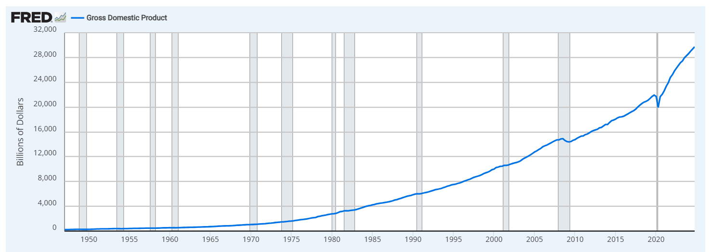

FRED also has data on the market cap of all companies in the US. This is how much money is in the stock market.

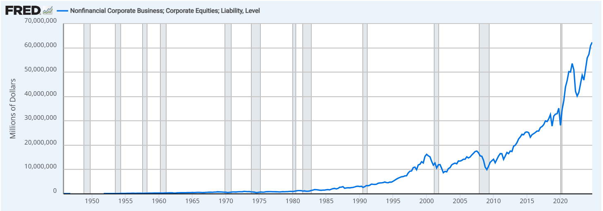

When you divide the GDP by the stock market capitalization, you get the "Buffett Indicator," a metric made popular by the famous invetsor, Warren Buffett.

This graph is one of the most useful graphs to measure if the stock market is over valued (in a bubble), or under valued. The stock market has no business being larger than the total value of the entire economy. 

As you can see, the Buffett Indicator, as of quarter 4 of 2024, is at 210%, indicating that the stock market is extremely overvalued.

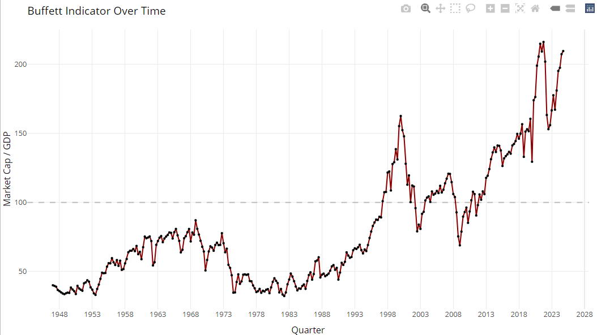

I imported recession data from FRED and cleaned it such that it can be used alongside the Buffett Indicator. 

The GDP and stock market cap has only been recorded since the mid 1940's. Recession data goes further back, and you can see all that data in the next graph:

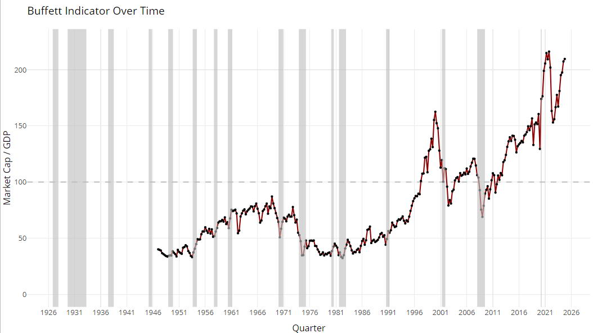

Another important indicator is margin debt, which is where stock market speculators can pump borrowed money into the stock market, which is extremely risky. You can see how margin debt has increased over time.

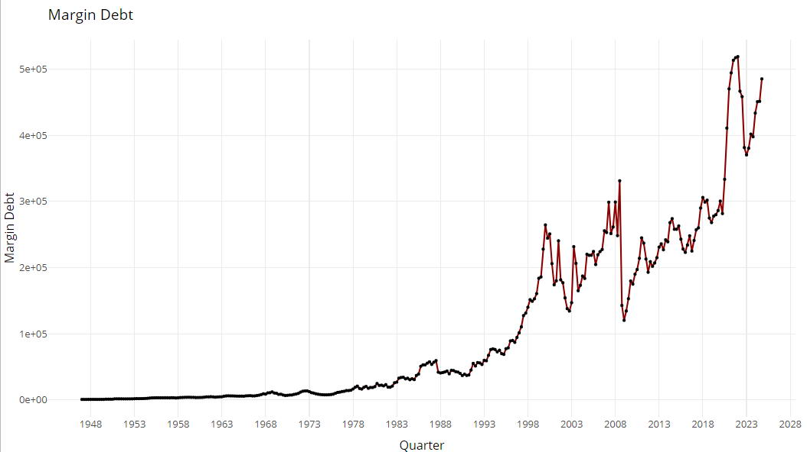

The following is a metric invented by precious metals investor, Mike Maloney. He calls it the "Market Fragility Index" and it multiplies the Bufett Indicator times Margin Debt.

See more on this metric here: https://www.youtube.com/watch?v=xFrsMMEQt2w

You can see "Dot-com" and housing bubbles and their following recessions. 

You can see that the current bubble we're in is about three times higher than the previous bubbles. Many people are calling it the "Everything bubble."

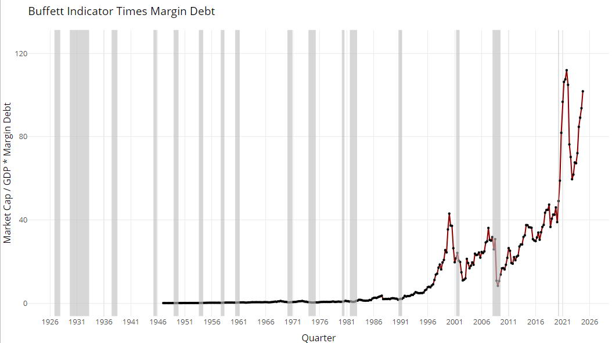

Another interesting metric is stock turnover rate, which can be used to calculate the average number of years that a stock is held by the average investor over time.

You can see that in the 1970s, the average investor held onto a stock for 5 years. Now, stocks are lucky to be held for more than a few months. 

This is important because value investors like Warren Buffett buy and hold stocks for the long term because they believe in the company behind that stock.

Most investors right now don't invest, they speculate in the market. This trend is dangerous because the average investor is not even gambling with their own money, they are gambing with margin debt.

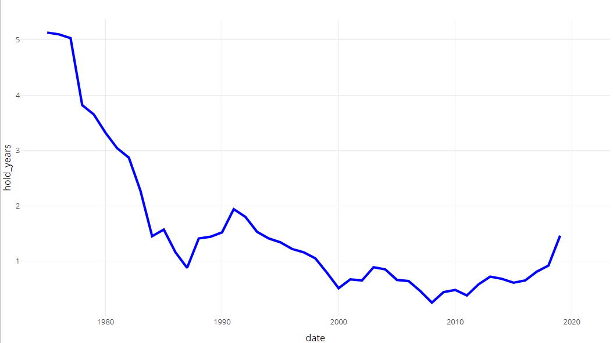

I thought I'd analyze the stocks that Warren Buffett curently holds, given that he's one of the most successful investors of all time. Here are the stocks he owns as of quarter 4 of 2024.

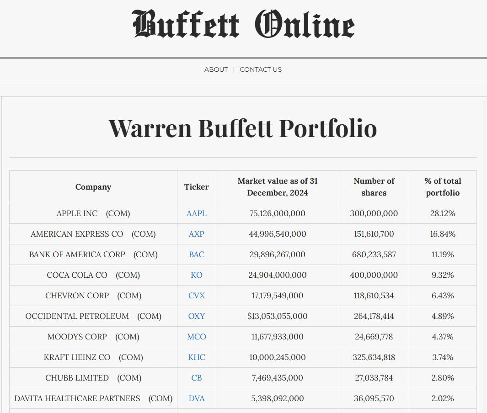

I used "Rvest" in RStudio to web scrape the table from Buffett's website.

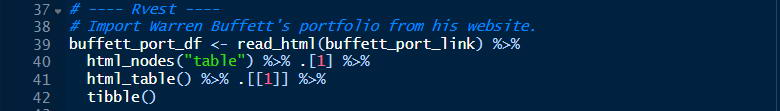

Extracting the ticker symbols from the scraped web page, I used these as the input to create an RStudio "List" which contained the stock data for all 38 stocks that Warren Buffett owns.

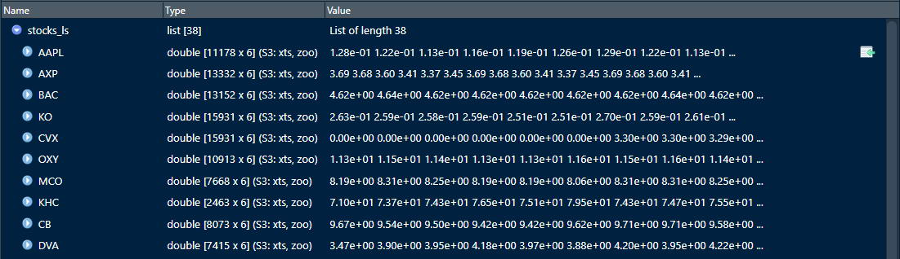

After normalizing the data for each stock such that every value is a percentage increase or decrease since the stock was created, I convert it all to long format so that I can graph it.

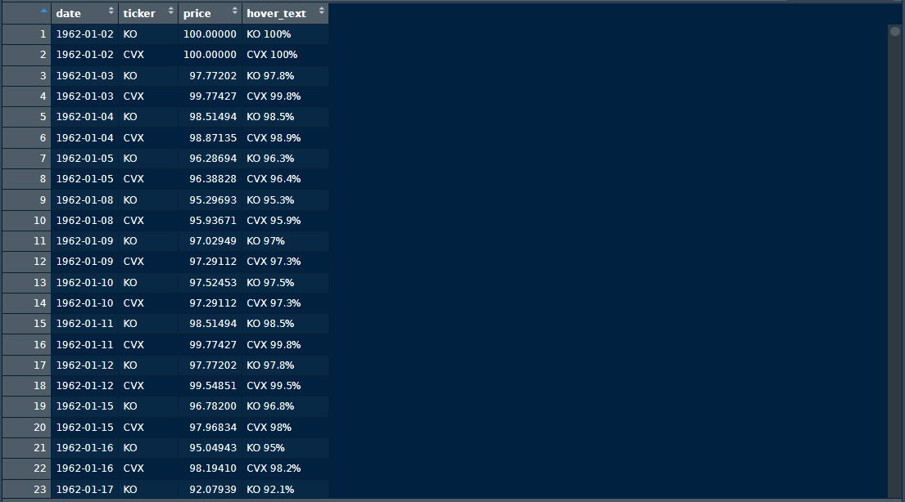

Below is a graph of Buffett's top 10 stocks by dollar value, normalized so that they can be compared to each other easily, the y-axis being logarithmic.

The next graph is a treemap which shows how much money Buffett has in each company. The lighter the blue color, the more profitable the stock. 

You can see that Amazon was very profitable, but Buffett only has 2.19 billion in it. This sounds like a lot, but Buffett is currently sitting on 334 billion dollars in cash. 

My guess is that the famous stock investor is looking at the Buffett indicator (which is at 210% as of quarter four of 2024) and waiting for stocks to drop before buying.

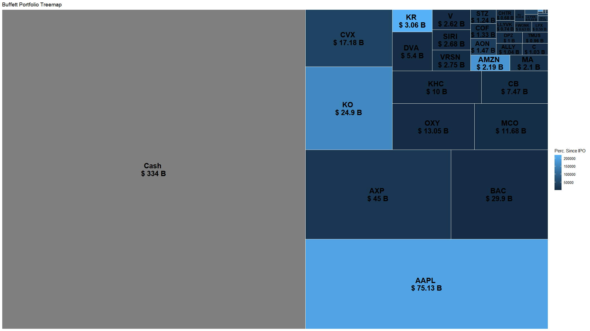

